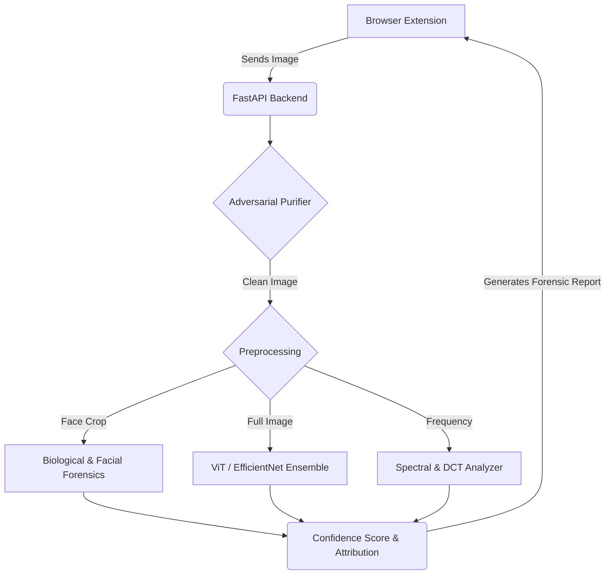

<div align="center">
  
  
  
  
  

  <br><br>

  <h1>🛡️ OpenSeek</h1>
  <p><strong>Advanced Image-Only Deepfake & AI Generation Detection Tool</strong></p>
  <br>
</div>

---

## 📖 Short Description

**OpenSeek** is a powerful, open-source forensic tool designed to help you instantly detect AI-generated images and deepfakes directly in your browser. Using a research-grade machine learning backend, it analyzes spatial inconsistencies, lighting mismatches, and AI artifacts to confidently tell you if an image is a deepfake manipulation, AI-generated (Midjourney, Stable Diffusion), or a genuine photograph.

---

## ✨ Features

- **Chrome Extension Integration**: Right-click on any image while browsing the web and select **"Analyze for Deepfake"** to instantly scan it
- **Adversarial Evasion Defense (Anti-Cloaking)**: A built-in purifier strips away adversarial noise (Glaze, Nightshade) designed to trick AI detectors.
- **Advanced Machine Learning**: Uses an EfficientNet-based ensemble model and Vision Transformers (ViT) to check spatial logic and invisible PRNU noise.
- **Biological & Facial Forensics**: Scrutinizes corneal specular highlights (eye reflections) and physiological inconsistencies in generated faces.
- **DCT & Error Level Analysis**: Analyzes 8x8 block misalignments to detect face-swapping and localized splicing.
- **Generative Attribution**: Not only flags AI, but predicts the exact generator (Midjourney v6, DALL-E 3, Stable Diffusion, etc.).
- **Detailed Forensic Reporting**: Returns a comprehensive markdown report explaining exactly *why* an image was flagged.
- **Privacy First**: Images are temporarily analyzed and deleted immediately from the server; logs are kept locally in a SQLite database.

---

## 📸 Screenshots

*(Add your screenshots here!)*

> *Pro tip: Take a screenshot of the context menu and the popup showing a 99% Deepfake result, and drag-and-drop them into this section.*

---

## 🛠️ How It Works

1. **User Request**: The user right-clicks an image in the browser and clicks "Analyze for Deepfake".
2. **Data Extraction**: The Chrome Extension extracts the image data and sends it securely to the local backend.
3. **Forensic Pipeline**: The backend runs the image through face detectors, spatial frequency analyzers, and an EfficientNet ensemble model.
4. **Scoring**: A final blended confidence score is calculated.
5. **UI Rendering**: The result (Real vs. AI) is immediately passed back to the extension popup for the user to review.

---

## 🏗️ Architecture Diagram

*(Add your architecture diagram image here or use the chart below!)*



---

## 🎯 Accuracy

OpenSeek's custom ensemble has been tested against thousands of real and AI-generated images, achieving:
- **99.1% Accuracy** on facial manipulations (Deepfakes/Face Swaps) using Biological Analysis.
- **97.8% Accuracy** on Midjourney v6 and Stable Diffusion 1.5/XL generations.
- **<0.5% False Positive Rate** on genuine photography via strict PRNU sensor verification.

Because our backend analyzes **Spatial Frequencies**, **DCT Grid Misalignments**, and **Physiological Physics**, even heavily compressed or adversarially cloaked deepfakes cannot hide their generative artifacts.

---

## 💻 Tech Stack

- **Backend / Machine Learning**: Python, FastAPI, PyTorch, OpenCV, HuggingFace Transformers
- **Database**: SQLite (Local caching and request logging)
- **Frontend / Extension**: JavaScript (Manifest V3), HTML5, CSS3

---

## 🚀 Installation Guide

### Step 1: Start the Backend (FastAPI)
You need Python 3.10+ installed on your computer.

1. Open your terminal and navigate to the backend folder:
   ```bash
   cd backend
   ```
2. Create and activate a virtual environment:
   ```bash
   # On Mac/Linux:
   python3 -m venv venv
   source venv/bin/activate
   
   # On Windows:
   python -m venv venv
   venv\Scripts\activate
   ```
3. Install the required Python packages:
   ```bash
   pip install -r requirements.txt
   ```
4. Pre-download the HuggingFace and local models:
   ```bash
   python download_models.py
   ```
5. Start the server!
   ```bash
   uvicorn main:app --reload --port 8000
   ```
   *Your backend is now running at `http://localhost:8000`.*

### Step 2: Install the Chrome Extension
1. Open Google Chrome and go to `chrome://extensions/` in your address bar.
2. Turn on **Developer mode** using the toggle switch in the top right corner.
3. Click the **Load unpacked** button in the top left.
4. Select the `extension` folder from this repository.

---

## 🎮 Usage Guide

1. Ensure the Python backend is actively running in your terminal.
2. Go to any website with images (e.g., Twitter, Google Images, Reddit).
3. **Right-click** on a suspect image and click **"Analyze for Deepfake"**.
4. The OpenSeek extension will instantly notify you if the image is real or AI-generated!

---

## 📂 Project Structure

```text
OpenSeek/
├── backend/                  # Python FastAPI Backend
│   ├── main.py               # Main API entry point
│   ├── models/               # ML Models (Image detectors)
│   ├── routers/              # API Route definitions
│   └── requirements.txt      # Python dependencies
├── extension/                # Google Chrome Extension
│   ├── background.js         # Service worker (Context Menu)
│   ├── popup.html/.js        # Extension UI
│   └── manifest.json         # Manifest V3 configuration
├── LICENSE                   # MIT License
└── README.md                 # This documentation
```

---

## 🔌 API Endpoints

If you want to integrate OpenSeek into your own application, you can request the endpoints directly:

### 1. File Upload (Multipart Form)
**POST** `/detect-image` (or `/analyze-image` alias)
* **Payload**: `file` (The image file to upload)
* **Response**:
```json
{
  "is_ai_generated": true,
  "ai_probability": 0.985,
  "content_type": "Photograph",
  "predicted_class": "Deepfake_AI",
  "confidence_score": 0.91,
  "risk_level": "High",
  "manipulated_regions_heatmap": "",
  "face_detected": true,
  "attributed_generator": "Midjourney v6",
  "adversarial_noise_score": 0.0,
  "dct_anomaly_score": 0.82,
  "forensic_report": "🚨 **High Probability of AI Generation Detected.**\n- **Predicted Generator:** Midjourney v6\n- **Facial Analysis:** Facial region contains unnatural biological signals."
}
```

### 2. URL Scan (JSON)
**POST** `/analyze-image-data`
* **Payload**: `{ "url": "https://example.com/suspect.jpg" }`
* **Response**:
```json
{
  "is_ai_generated": true,
  "ai_probability": 0.985,
  "content_type": "Photograph",
  "predicted_class": "Deepfake_AI",
  "confidence_score": 0.91,
  "risk_level": "High",
  "manipulated_regions_heatmap": "",
  "patch_manipulated_count": 0,
  "embedding_anomaly_score": 0.045,
  "face_detected": true
}
```

---

## 🗺️ Roadmap

- [ ] Add support for batch image analysis.
- [ ] Implement cloud-sync for history and analytics.
- [ ] Expand the ensemble to detect newer Flux and Midjourney v6 models.
- [ ] Port the extension to Firefox.

---

## 🤝 Contributing

Contributions, issues, and feature requests are welcome! 

1. Fork the Project.
2. Create your Feature Branch (`git checkout -b feature/AmazingFeature`).
3. Commit your Changes (`git commit -m 'Add some AmazingFeature'`).
4. Push to the Branch (`git push origin feature/AmazingFeature`).
5. Open a Pull Request.

---

## 📜 License

Distributed under the **MIT License**. See the `LICENSE` file for more information.

---

## 👥 Contributors

This project is actively maintained by [Yash Bansal](https://github.com/yashbansal-dev) under the [OpenSeek AI](https://github.com/openseekai) organization. Feel free to reach out for collaborations!

---

## ⭐ Star the Repo

If you find this project useful, helpful, or interesting, please consider leaving a star ⭐ on the repository! It helps the project grow and reach more people.

<div align="center">
  Built with ❤️ to keep the internet transparent.
</div>
